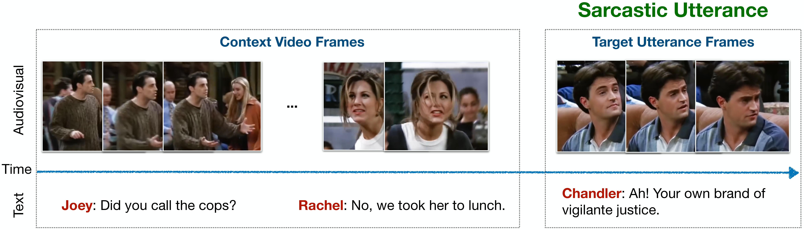

# MMSD: Multimodal Sarcasm Detection

This repository presents our ACL 2019 work "Towards Multimodal Sarcasm Detection (An *Obviously* Perfect Paper)".

We release the MMSD dataset which is a multimodal video corpus for research in automated sarcasm discovery. The dataset is compiled from popular TV shows including *Friends*, *The Golden Girls*, *The Big Bang Theory*, and *Sarcasmaholics Anonymous*. MMSD consists of audiovisual utterances annotated with sarcasm labels. Each utterance is accompanied by its context, which provides additional information on the scenario where the utterance occurs.

## Example Instance

<p align="center"> Example sarcastic utterance from the dataset along with its context and transcript. </p>     

## Raw Videos

The raw video clips including both the utterances and their respective context are available [here]().

## Data Format

The annotations and transcripts of the audiovisual clips are available at `data/sarcasm_data.json`. Each instance in the json file is alloted one identifier (e.g. "1\_60") which is a dictionary of the following items:   


| Key                     | Value                                                                          | 
| ----------------------- |:------------------------------------------------------------------------------:| 
| `utterance`             | The text of the target utterance to classify.                                  | 
| `speaker`               | Speaker of the target utterance.                                               | 
| `context`               | List of utterances (in chronological order) preceding the target utterance.    | 
| `context_speakers`      | Respective speakers of the context utterances.                                 | 
| `sarcasm`               | Binary label for sarcasm tag.                                                         | 

Example format in JSON:

```json
"1_60": {
  "utterance": "It's just a privilege to watch your mind at work.",
  "speaker": "SHELDON",
  "context": [
    "I never would have identified the fingerprints of string theory in the aftermath of the Big Bang.",
    "My apologies. What's your plan?"
  ],
  "context_speakers": [
    "LEONARD",
    "SHELDON"
  ],
  "sarcasm": true
}
```

## Citation

Please cite the following papers if you find this dataset useful in your research:

`S Castro, D Hazarika, V Pérez-Rosas,R Zimmermann, R Mihalcea, S Poria. Towards Multimodal Sarcasm Detection(An _Obviously_ Perfect Paper). ACL 2019.`
